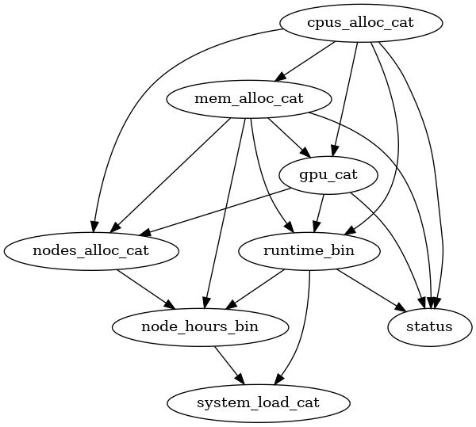
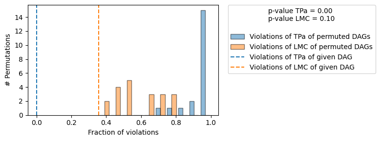
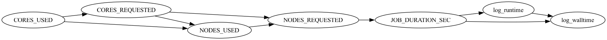

# Causal Inference for HPC Reliability

**Moving from correlation to causation in supercomputer job failures.** This project applies causal discovery and interventional analysis to real scheduler logs from two HPC systems, MIT Supercloud and ALCF Theta, to ask whether resource choices actually *cause* jobs to fail.

Final project for **CS 520: Causal Inference and Learning**, University of Illinois Chicago (Fall 2025).
📄 [Read the full report](report/CS520_Final_Report.pdf)

---

## The problem

Earlier studies of HPC logs found that bigger jobs (more nodes, cores, memory) fail more often, but those findings are correlational. We wanted to answer counterfactual questions such as: *would this job's failure probability change if it had requested fewer resources?*

This is hard because scheduler logs mix discrete and continuous variables, are heavily skewed, and have non-linear relationships, which break the assumptions of many standard causal discovery methods.

## Approach

```
EDA ──► Dual preprocessing ──► Causal discovery ──► Graph falsification ──► Effect estimation
        (discrete vs.          (PC, FCI, GES,       (permutation-based     (DoWhy GCM,
         continuous)            NOTEARS)             test, DoWhy)           do-interventions)
```

1. **Exploratory analysis.** Spearman vs. Pearson heatmaps and Q-Q plots showed monotonic but non-linear, heavy-tailed, non-Gaussian data.
2. **Dual preprocessing.** Every experiment ran on a *discrete* version (log transform, then binning) and a *continuous* version (standardized), to measure how representation affects the learned graph.
3. **Causal discovery.**
   * MIT Supercloud: PC, FCI and GES (constraint-based and score-based).
   * ALCF Theta: NOTEARS (optimization-based) plus FCI on a 10k-job slice to check for hidden confounders.
   * PNL (post-nonlinear model) for pairwise edge direction.
4. **Validation.** A permutation-based graph falsification test (Eulig et al., AAAI 2025) checked whether the learned DAG was consistent with the data.
5. **Effect estimation.** Fitted a graphical causal model with DoWhy and estimated average causal effects of `do(resource = level)` on job status.

## Key results

### MIT Supercloud: final causal graph (GES, discretized)



* Baseline runs showed **no clear causal parents of job status**. Switching from G² / Fisher-Z tests to the **Pillai trace CI test with BIC-CG scoring**, forcing `status` as a sink node, and using **aggressive binning (at most 4 bins)** produced a stable graph with meaningful edges into `status`.
* The falsification test flagged `partition` as problematic. After removing it, the revised graph passed: **0 of 20 permutations fell in its Markov equivalence class, and it beat 100% of permuted DAGs.**



**Average causal effects on job failure** (`status = 1` means failure):

| Intervention on | Large vs. Small | Medium vs. Small |
|---|---|---|
| GPU allocation | +0.0042 | +0.0003 |
| Runtime | -0.0026 | -0.0008 |
| CPU allocation | +0.0023 | +0.0042 |
| Memory allocation | -0.0035 | +0.0001 |

The effects are small, but the direction is consistent: more GPUs and CPUs slightly *raise* failure risk, while more memory (fewer out-of-memory crashes) and longer runtimes (fewer short debugging runs) slightly *lower* it.

### ALCF Theta (2017 to 2023)



* NOTEARS recovered an intuitive timing structure (requested/used resources → job duration → runtime and walltime) but found no strong direct causes of failure.
* FCI found a clear link between **user-specified walltime and job failure**, with the direction unresolved, pointing to possible hidden confounding.

## What we learned

* **Representation matters as much as the algorithm.** The same data gave very different graphs depending on binning and the choice of CI test.
* **Validate graphs without ground truth.** Falsification testing caught a bad variable that would otherwise have distorted effect estimates.
* **Causal graphs don't transfer across systems.** MIT and Theta log different features (Theta has no GPU fields), so each system needs its own graph.

## What I learned about causal inference

This course and project changed how I think about data. Most of my earlier ML work was about prediction: finding patterns that correlate with an outcome. Causal inference asks a different question: what would happen if we *changed* something? These are the main ideas I now understand and can apply.

**Correlation vs. causation, formally.** I learned the potential outcomes framework, where the causal effect of a treatment is the difference between outcomes that can never both be observed for the same unit, E[Y(1) - Y(0)]. The core challenge is identification: turning that unobservable quantity into something we can estimate from observational data, under clearly stated assumptions.

**Causal graphs as a language for assumptions.** DAGs make assumptions explicit and testable. I learned how conditional independence relates to graph structure through the Markov condition and faithfulness, why confounders create spurious associations, and why an intervention, do(X = x), is different from simply observing X = x.

**Causal discovery: learning the graph from data.** I worked with the three main families of structure learning algorithms and their trade-offs:
* **Constraint-based** methods (PC, FCI) build the graph from conditional independence tests. PC assumes no hidden confounders and returns an equivalence class (CPDAG), while FCI allows for hidden confounders and returns a PAG, which is more honest but often leaves edge directions unresolved.
* **Score-based** methods (GES) search for the graph that best balances fit and complexity, using scores like BIC or BDeu.
* **Functional and optimization-based** methods (LiNGAM, additive noise models, PNL, NOTEARS) use non-Gaussianity, nonlinearity, or continuous optimization to identify edge directions that independence tests alone cannot.

**Assumptions matter as much as algorithms.** The choice of conditional independence test (G², Fisher-Z, Pillai trace), how variables are represented (discrete vs. continuous), and whether the data are linear or Gaussian can change the learned graph completely. Real-world data breaks textbook assumptions, so knowing which assumption each method relies on is essential.

**Validating a graph without ground truth.** In practice there is no true DAG to compare against. I learned how falsification tests, such as comparing a graph's violations of conditional independence against randomly permuted graphs, can show whether a learned structure is at least consistent with the data before it is used for decisions.

**Estimating causal effects.** Once a graph is in place, the next step is estimating how much an intervention changes the outcome. I studied regression adjustment, propensity score matching, inverse probability weighting, instrumental variables, and quasi-experimental designs like difference-in-differences and regression discontinuity, along with the assumptions each one needs.

**Tools.** causal-learn (PC, FCI, GES, PNL), DoWhy and its graphical causal model API (falsification, fitting causal mechanisms, average causal effects), CausalNex (NOTEARS), and pgmpy.

**My main takeaway:** causal claims are only as strong as the assumptions behind them. A good causal analysis states those assumptions, tests them where possible, and is honest about what the data cannot tell us.

## Repository structure

```
├── mit_supercloud/
│   ├── eda.ipynb              # EDA: distributions, linearity, Q-Q plots
│   ├── discover.ipynb         # PC / FCI / GES experiments
│   ├── discover_script.py     # CLI version of the discovery runs
│   ├── test_dags.ipynb        # Graph falsification + DoWhy ACE estimation
│   ├── pnl_run.py             # Pairwise direction tests with PNL
│   ├── *.gml                  # Learned graphs used downstream
│   └── figures/               # All learned DAGs
├── theta_analysis/            # Theta EDA, NOTEARS and FCI scripts + results
├── assets/                    # Figures used in this README
├── data/                      # Where to put the datasets (not included)
├── report/                    # Final report (PDF)
└── requirements.txt
```

## Running it

```bash
pip install -r requirements.txt
```

1. Download the datasets as described in [`data/README.md`](data/README.md).
2. MIT Supercloud: run the notebooks in `mit_supercloud/` in order (`eda` → `discover` → `test_dags`), or use the script:
   ```bash
   cd mit_supercloud
   python discover_script.py dis GES 0.01   # discrete data, GES
   python discover_script.py mixed PC 0.01  # mixed data, PC
   ```
3. Theta: see [`theta_analysis/README.md`](theta_analysis/README.md).

## Tech stack

Python · causal-learn · DoWhy (GCM) · CausalNex (NOTEARS) · pgmpy · pandas · scikit-learn · NetworkX · Graphviz

## Team

Group project by **Armaan Ashfaque, Smita Darmora and Sarah Zahir Syeda**.

**My contributions:** _[Fill in, e.g. "Led the ALCF Theta analysis: data cleaning, NOTEARS and FCI experiments, and EDA."]_

## References

* Samsi et al., *The MIT Supercloud Dataset*, IEEE HPEC 2021.
* Eulig et al., *Toward Falsifying Causal Graphs Using a Permutation-Based Test*, AAAI 2025.
* Zheng et al., *DAGs with NO TEARS*, NeurIPS 2018.
* Sharma and Kiciman, *DoWhy: An End-to-End Library for Causal Inference*, 2020.

Full references are in the [report](report/CS520_Final_Report.pdf).
